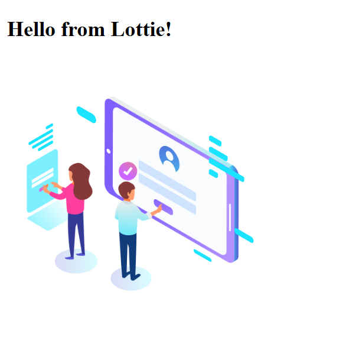
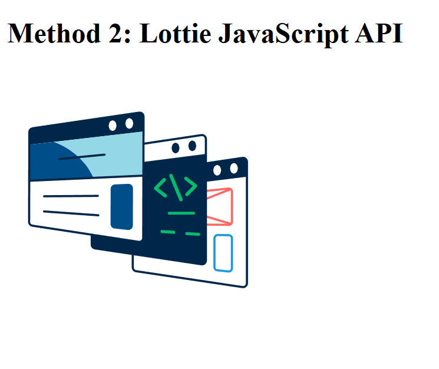
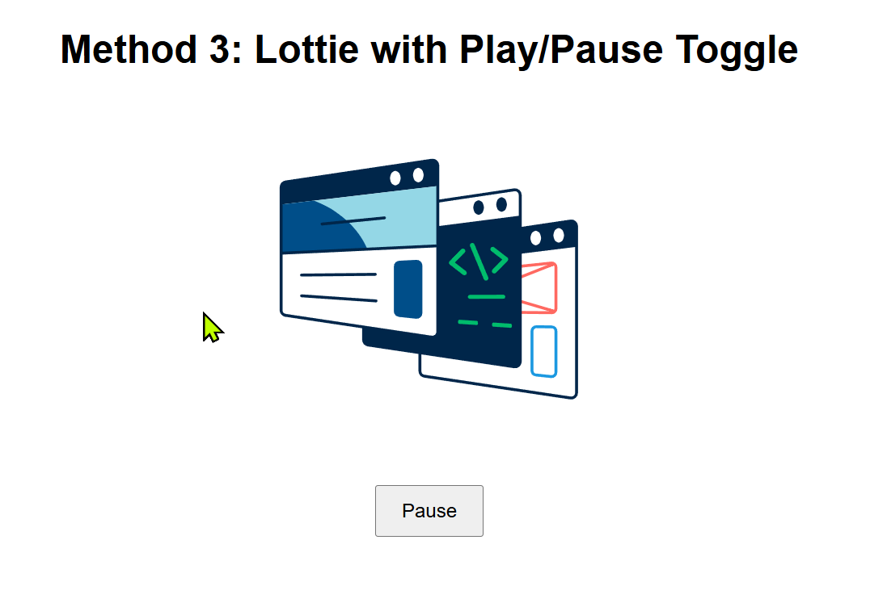

# Lottie Integration Site

🎨 A responsive webpage that integrates smooth vector animations using Lottie. Designed with modern layout principles and optimized for performance.

## 🔧 Tech Used
- HTML5
- CSS3
- JavaScript
- Lottie-web (via CDN)

## 🧩 Two Lottie Integration Methods

1. [View Web Component Method](https://itz-akhilesh.github.io/lottie-integration-site/)
2. [View JavaScript API Method](https://itz-akhilesh.github.io/lottie-integration-site/method-2-js-api.html)
3. [View toggle switch JavaScript API Method](https://itz-akhilesh.github.io/lottie-integration-site/method-3-toggle.html)


## 📦 Features
- Lightweight and fast
- Scalable vector animations via JSON
- Great for SaaS, startup, and product hero sections

## 📸 Preview
# Lottie Integration Site

A showcase of 3 different methods to embed and control Lottie animations in a web project.

---

## 🔗 Live Demos

- **Method 1 – Web Component**  
  👉 [View Demo](https://itz-akhilesh.github.io/lottie-integration-site/index.html)  
  



- **Method 2 – JavaScript API**  
  👉 [View Demo](https://itz-akhilesh.github.io/lottie-integration-site/method-2-js-api.html)  
  

- **Method 3 – Toggle Play/Pause with JS**  
  👉 [View Demo](https://itz-akhilesh.github.io/lottie-integration-site/method-3-toggle.html)  
  

---

## 💡 What’s Inside?

- ✔️ Lottie Player integration
- ✔️ Custom animation from local JSON
- ✔️ JavaScript API usage with controls
- ✔️ Toggle play/pause functionality

---

## 📌 Use This If You...

- Want to add engaging animations to landing pages
- Work with WordPress/Shopify and want to enhance UX
- Need to show clients that you can do real interactions with code


```md
